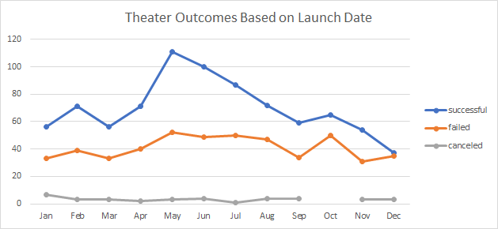
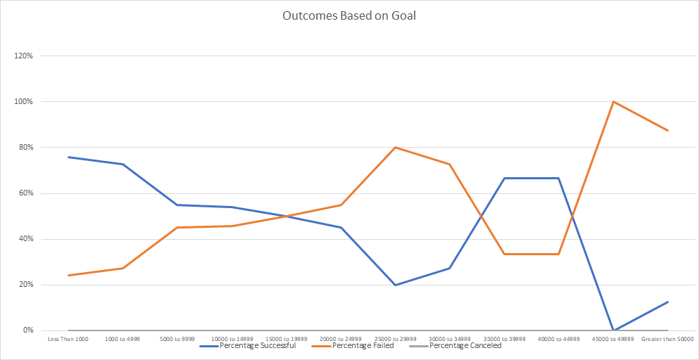

# Kickstarting with Excel

## Overview of Project

### Purpose
This project's goal was to aid Louise by giving her an analytical perspective of how different campaigns preformed based on their launch date and funding goals. This analysis looked at theater related kickstarter campaigns for performance related to campaign launch date, and then how kickstarters specifically for plays fared depending on fundraising goals

## Analysis and Challenges

### Analysis of Outcomes Based on Launch Date
We were able to compare the outcome of a kickstarter campaigns based on the month it launched by putting all the data in a pivot table. We filtered the criteria based off of Parent Category and Years and then organized the data with Date Created being the field our rows and using Outcomes as both our columns and values. We were able to visualize the data by using a line chart with the months as the x-axis and the number of outcomes as the y-axis. 

### Analysis of Outcomes Based on Goals
We also looked at the outcomes of kickstarted campaigns based on goals by using the COUNTIFS function in excel to pinpoint the number of successful, failed and canceled campaigns in the play subcategory based off of specific ranges for the goals. We nested COUNTIFS criteria in the formula in order to provide a comprehensive way to count the number of occurances based on the specific criteria needed for each cell. Once we had the number of occurances for each outcome at the vaious goal ranges, we found the sum of total campaigns at each goal range. Once this was determined, we were able to calculate the percentage of "Successful", "Failed" and "Canceled" campaigns for each range. Once all of our deliverables were calculated, we then created a line chart to visually demonstrate the analysis based off of the percentages where the y- axis was percentage and the x-axis was range of fundraising goal. Because there were no canceled kickstarter campaigns for plays, the lines for "Successful" and "Failed" campaigns mirrored eachother as one would expect.  

### Challenges and Difficulties Encountered
This analysis used a lot of functions and skills in Excel that we are familiar with so it was a good refresher and allowed us to hone in some of the skills we haven't used in a while. We had limited experience with nesting COUNTIF formulas and resulted in not realizing that we could filter both the outcome and the subcategory inside the formula. At first, we created a separate sheet for each outcome category for plays. It was brought to our attention that all this work could and should be done in the formula. Other than this instance, not having experience with pivot tables and properly organizing the fields, creating and formatting charts as well as using sum and percentage formulas could create some roadblocks since these skills can be challenging at first.

## Results

### What are two conclusions you can draw about the Outcomes based on Launch Date?
Based on the analysis, we can conclude that the most successful campaigns are launched in April, May and June. We can also draw from the analysis that October, November and December are not great times to launch a kickstarter campaign.

### What can you conclude about the Outcomes based on Goals?
From this analysis, we can conclude that the most successful campaigns had goals of less than $5,000.

### What are some limitations of this dataset?
We are limited by the number of data points to some degree. For example, if we had more data on cancelations, we could draw more conclusions about how a launch date may affect the amount of cancelations if at all. With this data set, there aren't enought occurances to make an objective observation. And as for Outcomes based on goals, our data set skews to the left with an overwhelming number of campaigns having goals of less than $10,000. To get a more conclusive assessment of whether or not goals influence outcomes, we would need a more evenly dispersed data set.

### What are some other possible tables and/or graphs that we could create?
We could come up with additional analysis by creating a chart that included the percentage of outcomes vs launch date. Since we have a range of 75 to 166 plays depending on which month we look at, a percentage will help minimize frequency bias. For the outcomes based on goals, we could analyze different categories and sub categories using the similar charts and tables to see if the trend occurs in other data sets. If we could find several data sets that have more symmetrical data pertaining to goals, we could come up with a stronger and more complete analysis.

